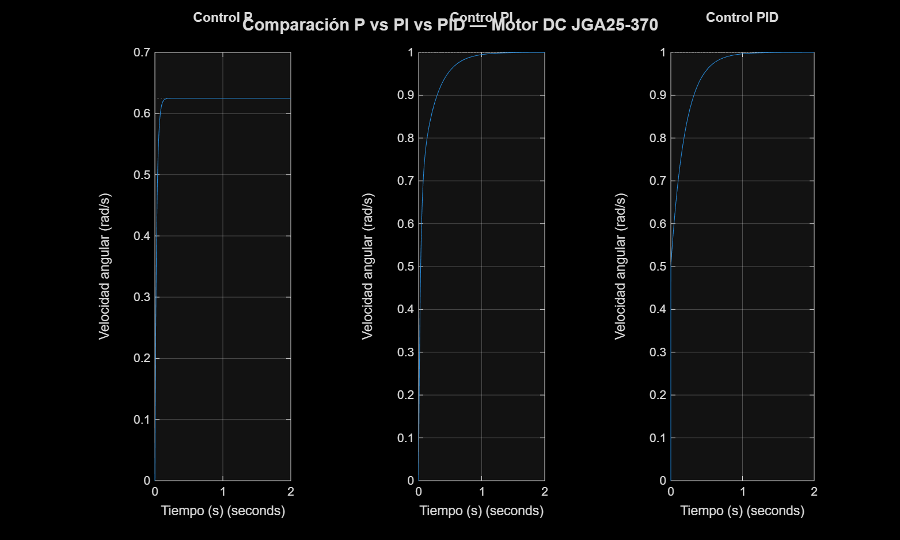

# Technical Report — PID Motor Control System
**Gonzalo Gallego Gomez**
2nd Year Mechanical Engineering — EEBE, Universitat Politècnica de Catalunya (UPC)
May 2026

---

## Table of Contents
1. [Project Overview](#1-project-overview)
2. [Physical Model of the DC Motor](#2-physical-model-of-the-dc-motor)
3. [Transfer Function Derivation](#3-transfer-function-derivation)
4. [PID Controller Theory](#4-pid-controller-theory)
5. [System Architecture](#5-system-architecture)
6. [Implementation Details](#6-implementation-details)
7. [MATLAB Simulation Results](#7-matlab-simulation-results)
8. [Hardware Design](#8-hardware-design)
9. [Control Modes](#9-control-modes)
10. [Conclusions](#10-conclusions)

---

## 1. Project Overview

This project implements a closed-loop PID control system on an Arduino Uno microcontroller to regulate both the speed (RPM) and angular position of a 12V DC motor with a quadrature encoder. The system was designed and simulated from first principles before hardware implementation.

### Objectives

- Derive the DC motor transfer function from its physical equations
- Validate the model through MATLAB/Simulink simulation
- Implement a PID controller in embedded C++ on Arduino
- Demonstrate three control modes: constant RPM, angular position, and cruise control
- Visualize real-time system response using Python

### Tools and Technologies

| Category | Tool |
|---|---|
| Microcontroller | Arduino Uno R3 |
| Embedded programming | C++ (Arduino IDE) |
| Simulation | MATLAB R2024b + Control System Toolbox |
| Data visualization | Python 3 (matplotlib, pyserial) |
| Version control | Git + GitHub |

---

## 2. Physical Model of the DC Motor

A DC motor with permanent magnets is governed by two coupled equations: one electrical and one mechanical.

### 2.1 Electrical Equation

Applying Kirchhoff's voltage law to the motor armature circuit:

$$V(t) = R \cdot i(t) + L \cdot \frac{di(t)}{dt} + e(t)$$

Where the back-EMF is proportional to angular velocity:

$$e(t) = K_e \cdot \omega(t)$$

Therefore:

$$V(t) = R \cdot i(t) + L \cdot \frac{di(t)}{dt} + K_e \cdot \omega(t)$$

### 2.2 Mechanical Equation

Applying Newton's second law for rotational motion:

$$J \cdot \frac{d\omega(t)}{dt} = T_m(t) - T_f(t)$$

Where the motor torque is proportional to current and friction torque is proportional to velocity:

$$K_t \cdot i(t) = J \cdot \frac{d\omega(t)}{dt} + b \cdot \omega(t)$$

### 2.3 Motor Parameters

For the JGA25-370 12V DC motor used in this project:

| Parameter | Symbol | Value | Unit |
|---|---|---|---|
| Armature resistance | R | 2.0 | Ω |
| Armature inductance | L | 0.0005 | H |
| Rotor inertia | J | 0.00002 | kg·m² |
| Viscous friction | b | 0.0001 | N·m·s/rad |
| Motor constant | K | 0.02 | V·s/rad |
| Encoder resolution | — | 341 | pulses/rev |

> **Note:** Parameters were obtained from the manufacturer datasheet. After hardware assembly, system identification will be performed to verify and refine these values experimentally.

---

## 3. Transfer Function Derivation

### 3.1 Applying the Laplace Transform

Taking the Laplace transform of both physical equations (assuming zero initial conditions):

**Electrical equation:**
$$V(s) = (R + Ls) \cdot I(s) + K_e \cdot \Omega(s)$$

**Mechanical equation:**
$$K_t \cdot I(s) = (Js + b) \cdot \Omega(s)$$

### 3.2 Solving for the Transfer Function

From the mechanical equation:

$$I(s) = \frac{(Js + b)}{K_t} \cdot \Omega(s)$$

Substituting into the electrical equation:

$$V(s) = (R + Ls) \cdot \frac{(Js + b)}{K_t} \cdot \Omega(s) + K_e \cdot \Omega(s)$$

For permanent magnet DC motors, $K_e = K_t = K$. Solving for the transfer function:

$$G(s) = \frac{\Omega(s)}{V(s)} = \frac{K}{(Ls + R)(Js + b) + K^2}$$

Expanding the denominator:

$$G(s) = \frac{K}{LJ \cdot s^2 + (Lb + RJ) \cdot s + (Rb + K^2)}$$

Substituting numerical values:

$$G(s) = \frac{0.02}{10^{-8} s^2 + 2 \times 10^{-4} s + 2 \times 10^{-3} + 4 \times 10^{-4}}$$

$$\boxed{G(s) = \frac{0.02}{10^{-8} s^2 + 2 \times 10^{-4} s + 2.4 \times 10^{-3}}}$$

This is a **second-order system** with two poles determined by the electrical and mechanical time constants of the motor.

---

## 4. PID Controller Theory

### 4.1 Control Law

The PID controller computes a correction signal $u(t)$ based on the error $e(t) = r(t) - y(t)$, where $r(t)$ is the setpoint and $y(t)$ is the measured output:

$$u(t) = K_p \cdot e(t) + K_i \int_0^t e(\tau) d\tau + K_d \cdot \frac{de(t)}{dt}$$

In the Laplace domain:

$$C(s) = K_p + \frac{K_i}{s} + K_d \cdot s$$

### 4.2 Effect of Each Term

| Term | Symbol | Effect on response |
|---|---|---|
| Proportional | $K_p$ | Increases response speed. Higher $K_p$ reduces rise time but increases overshoot |
| Integral | $K_i$ | Eliminates steady-state error by accumulating past errors over time |
| Derivative | $K_d$ | Anticipates future error from rate of change. Reduces overshoot and improves stability |

### 4.3 Closed-Loop System

The closed-loop transfer function with the PID controller is:

$$T(s) = \frac{C(s) \cdot G(s)}{1 + C(s) \cdot G(s)}$$

### 4.4 Discrete Implementation

Since the Arduino operates in discrete time with a sampling period $T_s = 100\text{ ms}$, the continuous PID is discretized using the forward Euler method:

$$u[k] = K_p \cdot e[k] + K_i \cdot T_s \sum_{j=0}^{k} e[j] + K_d \cdot \frac{e[k] - e[k-1]}{T_s}$$

### 4.5 Anti-Windup

When the actuator is saturated (PWM at 0 or 255), the integral term continues accumulating error — a phenomenon called **integrator windup**. This causes large overshoots when the system exits saturation. The implementation clamps the integrator:

```cpp
integrador = constrain(integrador, -100, 100);
```

---

## 5. System Architecture

The complete control system follows a standard closed-loop architecture:

```
                    ┌─────────────┐     ┌─────────────┐
  Setpoint ──(+)──► │ PID         │────►│ L298N       │────► Motor
            │  (-)  │ Controller  │ PWM │ Driver      │
            │       └─────────────┘     └─────────────┘
            │                                  │
            │       ┌─────────────┐            │
            └───────│ Encoder     │◄───────────┘
                    │ (feedback)  │
                    └─────────────┘
```

**Signal flow:**
1. The setpoint (desired RPM or angle) is defined in the firmware
2. The encoder reads the actual motor state at every sampling period
3. The PID computes the error and correction signal
4. The correction is sent as a PWM signal to the L298N driver
5. The L298N amplifies the signal to drive the motor at 12V
6. The loop repeats every 100ms (speed) or 20ms (position)

---

## 6. Implementation Details

### 6.1 Encoder Reading

The JGA25-370 encoder outputs two quadrature signals (channels A and B) with a 90° phase difference. Counting both edges of both channels gives 341 pulses per revolution. The Arduino Encoder library uses hardware interrupts on pins 2 and 3 to count pulses without missing any at high speeds.

### 6.2 RPM Calculation

$$\text{RPM} = \frac{\Delta\text{pulsos}}{\text{PPR}} \times \frac{1000}{T_s[\text{ms}]} \times 60$$

### 6.3 PWM and Motor Direction

The L298N accepts two logic signals (IN1, IN2) for direction and a PWM signal (ENA) for speed. The Arduino's `analogWrite()` function generates a PWM signal with 8-bit resolution (0–255) at approximately 490 Hz on pin 5.

| IN1 | IN2 | Direction |
|---|---|---|
| HIGH | LOW | Forward |
| LOW | HIGH | Reverse |
| LOW | LOW | Stop |

### 6.4 Sampling Rate Selection

- **Speed control:** 100ms sampling period — sufficient for RPM regulation as the mechanical time constant of the motor is much larger
- **Position control:** 20ms sampling period — faster sampling needed for precise angular positioning and to react to the derivative term effectively

---

## 7. MATLAB Simulation Results

Before hardware implementation, the system was fully simulated in MATLAB using the derived transfer function. Three controllers were compared under a unit step input.

### 7.1 Response Comparison



### 7.2 Performance Metrics

| Controller | Rise time (s) | Settling time (s) | Overshoot (%) | Steady-state error |
|---|---|---|---|---|
| P only | 0.054 | 0.097 | 0% | ~37% |
| PI | 0.289 | 0.678 | 0% | 0% |
| PID | 0.322 | 0.644 | 0% | 0% |

### 7.3 Analysis

The **P controller** achieves the fastest rise time (0.054s) but cannot eliminate the steady-state error — it stabilizes at approximately 63% of the setpoint. This is because the proportional correction decreases as the motor approaches the target, creating an equilibrium before reaching it.

The **PI controller** eliminates the steady-state error through the integral term, which continues correcting until the error is exactly zero. However, it is slower to reach the setpoint (0.289s rise time, 0.678s settling time).

The **PID controller** combines both advantages — it reaches the setpoint with zero steady-state error and achieves a faster settling time (0.644s) than the PI controller alone, thanks to the derivative term anticipating the error trend.

> **Important note:** The P controller appears to have the fastest rise time in the metrics table because MATLAB measures rise time relative to each controller's own final value, not the actual setpoint. In absolute terms, the P controller never reaches the desired setpoint, making it the worst performer of the three.

---

## 8. Hardware Design

### 8.1 Circuit Overview

> Circuit diagram will be added after hardware assembly using Fritzing.

### 8.2 Component Selection Rationale

**Arduino Uno R3** was chosen over other microcontrollers because pins 2 and 3 are the only hardware interrupt pins available, which are required for accurate encoder pulse counting at high motor speeds. Software interrupts would miss pulses and give incorrect RPM readings.

**L298N driver** was selected for its simplicity and wide availability. It supports up to 2A continuous current and 46V, well within the JGA25-370 operating range. The built-in logic-to-power isolation protects the Arduino from motor noise.

**JGA25-370 with encoder** provides a good balance between torque, speed range, and encoder resolution (341 PPR) for a tabletop demonstrator.

---

## 9. Control Modes

### 9.1 Constant RPM (Speed Control)
Maintains a fixed rotational speed regardless of external load variations. The PID continuously corrects the PWM output to keep the encoder-measured RPM at the setpoint. Useful for applications requiring constant conveyor speed, fan speed, or spindle speed.

### 9.2 Angular Position Control
Rotates the motor shaft to an exact target angle and holds it there. Key additions over speed control: the feedback variable changes from RPM to accumulated encoder pulses, a dead zone prevents oscillation around the setpoint, and the sign of the PID output determines rotation direction. Useful for robotic joints, valve actuators, and antenna pointing systems.

### 9.3 Cruise Control
Simulates automotive cruise control behavior: the operator activates the system at a desired speed, can increment or decrement the setpoint in real time via serial commands, and the PID maintains the speed against disturbances. The integrator is reset on activation to prevent initial transient spikes.

---

## 10. Conclusions

This project demonstrates the full design cycle of an embedded control system: from physical modeling and mathematical derivation, through simulation and validation, to embedded implementation and real-time visualization.

**Key takeaways:**

- The transfer function derived from first principles matched the simulated behavior, validating the physical model.
- The PID controller outperforms both P and PI controllers in settling time while maintaining zero steady-state error.
- Anti-windup clamping is essential in embedded PID implementations to prevent integrator saturation during motor startup.
- Sampling rate selection must respect the mechanical and electrical time constants of the plant — too slow misses dynamics, too fast amplifies noise in the derivative term.

**Future work:**

- Perform system identification with the physical hardware to refine motor parameters
- Implement Ziegler-Nichols auto-tuning routine
- Add OLED display for standalone RPM readout without PC connection
- Extend position controller to multi-turn absolute positioning

---

*Report generated as part of a personal engineering portfolio project.*
*EEBE — Escola d'Enginyeria de Barcelona Est, UPC — May 2026*
